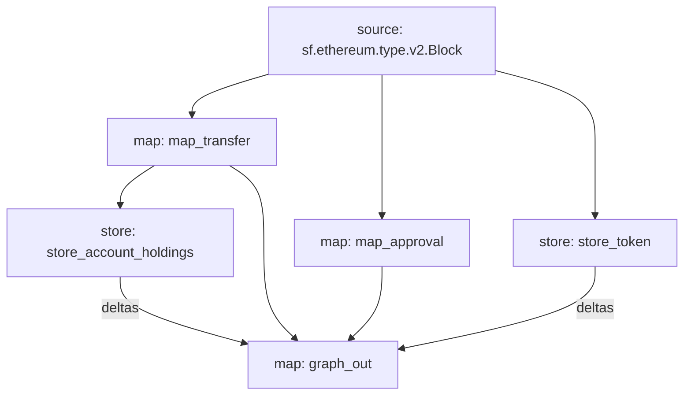

# Tornado Cash Substream
This substream's  aim is to show the Tornado Cash Vault Analytics by way of Tracking Deposits and withdrawal in usdc and eth. 

## Quickstart

Make sure you have the latest versions of the following installed:

- [Rust](https://rustup.rs/)
- [Make](https://formulae.brew.sh/formula/make)
- [graph-cli](https://thegraph.com/docs/en/cookbook/quick-start/#2-install-the-graph-cli)
- [substreams-cli](https://substreams.streamingfast.io/getting-started/installing-the-cli)


### 1. Compile the Project with `make build`

We now need to recompile our WASM binary with the new changes we made to the rust files.

### 2. Pack the spkg with `make package`

We need to bundle the protobuf definitions and the WASM binary into a single file. This is what we will deploy the subgraph.

### 3. Deploy the subgraph with `graph deploy`

Modify the package.json to point to your subgraph.
The deploy script will change if you are deploying to the hosted service or decentralized network, but replace this with the command that is appropriate for your setup.

### 4. Schema

```graphql
type Account @entity {
  id: ID!
  holdings: BigDecimal!
  sent: [Transfer!]! @derivedFrom(field: "sender")
  received: [Transfer!]! @derivedFrom(field: "receiver")
  approvals: [Approval!]! @derivedFrom(field: "owner")
}

type Transfer @entity(immutable: true) {
  id: ID!
  sender: Account
  receiver: Account!
  amount: String!
  token: Token!
  timestamp: BigInt!
  txHash: String!
  blockNumber: BigInt!
  logIndex: BigInt!
}

type Approval @entity(immutable: true) {
  id: ID!
  spender: String!
  owner: Account!
  amount: String!
  timestamp: BigInt!
  token: Token!
  txHash: String!
  blockNumber: BigInt!
  logIndex: BigInt!
}

type Token @entity {
  id: ID!
  name: String!
  address: String!
  symbol: String!
  decimals: String!
  transfers: [Transfer!]! @derivedFrom(field: "token")
  approvals: [Approval!]! @derivedFrom(field: "token")
}
```

### 5. Data Flow

